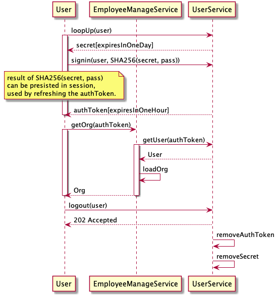
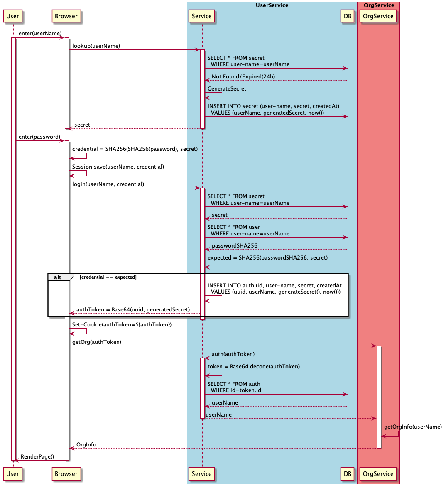

## Summary

This component will focus on user management:
* User Sign in
* User Sign up/ User register
* Password management
* Authentication
* Authorization

## Overall workflow


## User Case details
### User Sign in


User will be able to sign in to the system using *UserName* & *Password*.

1. lookup
```
POST /lookup
{
    "UserName": "MyName",
}

Response
{
    "Secret": "MySecret"
}

```

1. sign in
```
POST /login
{
    "UserName": "MyName",
    "PasswordHash": "HashedPassword"
}

Response
{
    "AuthToken": "MyAuthToken"
}
```

User will be able to logout

1. logout
```
POST /
```
